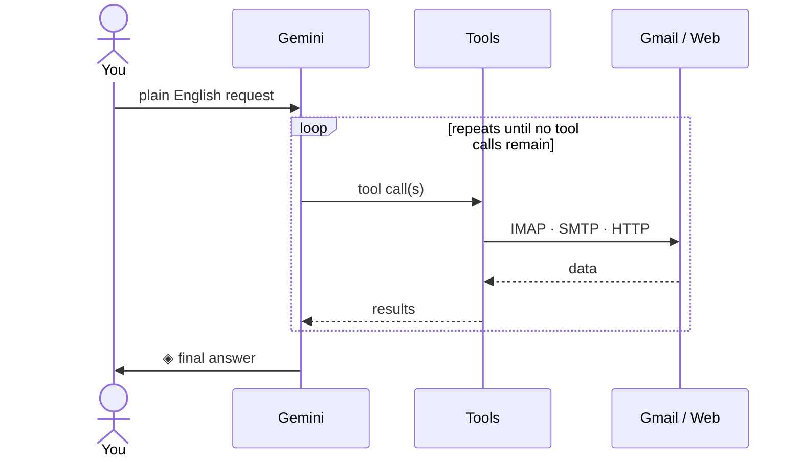

[](https://deepwiki.com/ankitpandey2708/gmail_agent)

# Gmail Agent

A plain-English terminal interface for Gmail — powered by Google Gemini. Type what you want in natural language; the agent figures out which tools to call, in what order, and asks for approval before anything destructive.

```
  ◈  GMAIL AGENT
  ━━━━━━━━━━━━━━━━━━━━━━━━━━━━━━━━━━━━━━━━━━━━━━━━━━━━━━
  your@gmail.com
  Model: gemma-4-31b-it
  ━━━━━━━━━━━━━━━━━━━━━━━━━━━━━━━━━━━━━━━━━━━━━━━━━━━━━━
  ↑↓ history  ·  help for examples  ·  status  ·  quit  ·  clear

  ❯ trash all newsletters older than 3 months
```

---

## Features

| Capability | Example request |
|---|---|
| **Search** | `emails from stripe.com this week` |
| **Read** | `what did the invoice from Razorpay say?` |
| **Threads** | `show the full conversation with Sarah` |
| **Attachments** | `read the PDF in the contract email` |
| **Reply** | `reply saying I'll pay by Friday` |
| **Trash** | `delete all promotional emails older than 30 days` |
| **Labels** | `label the job offer email as 'offers'` |
| **Read state** | `mark all GitHub emails as read` |
| **Unsubscribe** | `unsubscribe from this newsletter` |
| **Calendar** | `create a meeting tomorrow at 3pm called Team Sync` |

Every destructive action — trash, send, HTTP request — requires explicit `y` confirmation before it runs. Draft replies support a **Send / Edit / Cancel** loop so you can revise before sending.

---

## How it works

The agent runs a **ReAct loop** — Reason, Act, Observe, repeat — until the model decides it has enough information to answer.



Before hitting IMAP, every search passes through a **query rewriter** — a fast, separate Gemini call that translates your intent into up to three Gmail search syntax variants (`from:stripe.com subject:invoice`, `from:stripe.com`, `invoice`) and tries each in order until one returns results.

---

## Project structure

```
gmail_agent/
├── main.py      ← entry point — ReAct loop + terminal REPL
├── tools.py      ← 12 tool functions + IMAP helpers + schema declarations
├── ui.py         ← terminal design system (colours, layout, prompts)
├── config.py     ← env vars, Gemini client, shared state
├── .env          ← credentials (not committed)
└── .env.example  ← template
```

**Import chain** — no circular dependencies:

```
config  ←  ui  ←  tools  ←  agent
```

---

## Setup

### 1. Prerequisites

- Python 3.11+
- A Gmail account with **IMAP enabled** (Settings → See all settings → Forwarding and POP/IMAP)
- A **Gmail App Password** — [generate one here](https://myaccount.google.com/apppasswords) (requires 2FA)
- A **Gemini API key** — [get one here](https://aistudio.google.com/apikey)

### 2. Install dependencies

```bash
pip install google-genai python-dotenv requests beautifulsoup4 pypdf
```

### 3. Configure credentials

Copy the example and fill in your values:

```bash
cp .env.example .env
```

`.env`:
```env
EMAIL=you@gmail.com
APP_PASSWORD=xxxx-xxxx-xxxx-xxxx
GEMINI_KEY=AIza...
MODEL=gemma-4-31b-it
```

> **`APP_PASSWORD`** is a 16-character app-specific password, not your regular Gmail password.  
> **`MODEL`** can be any Gemini model — `gemini-2.0-flash`, `gemma-4-31b-it`, etc.

### 4. Run

```bash
python main.py
```

---

## Built-in commands

| Command | Action |
|---|---|
| `help` or `?` | Show categorised example requests |
| `status` | Connection info, model, cached emails |
| `clear` | Reset conversation history and email cache |
| `quit` or `exit` | End the session |
| `↑` / `↓` | Navigate command history |

### Approval prompts

Destructive and outbound actions pause for confirmation:

```
  ──────────────────────────────────────────
  ⚠  Move to trash?  [y/n]  ›
```

Draft replies use a three-way prompt:

```
  ⚠  Send [s]    Edit [e]    Cancel [c]  ›
```

Choosing **Edit** opens an inline editor — type your revision and submit with a blank line.

---

## Capability gaps

When the agent encounters a request it can't handle with existing tools, it calls `suggest_new_tool` and logs the gap to `unknown_tools.json`. This file grows over time and documents what to build next.

---

## Security notes

- Credentials live in `.env` — never commit this file.
- The `.gitignore` excludes `.env` and `unknown_tools.json` by default.
- App passwords are scoped to a single app and can be revoked without changing your Gmail password.
- No email content is stored to disk — the in-session cache lives in memory and resets on `clear` or exit.

##
ruff format .
ruff check .
ruff check --fix .
vulture .

## https://www.playtime.sh/blog/inbox-pilot